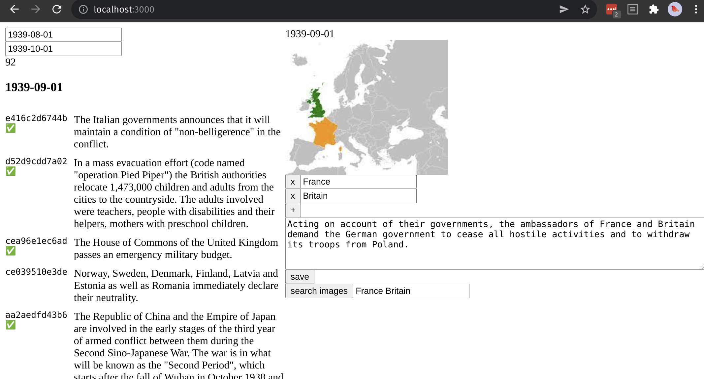

# WW2 Event Scraper

Scraper and React App editor for WW2 Events. 
- scraper runs locally in a python server. Bulk loads into firebase
- react app calls scraper APIs for updating images if needed




# Install & Run

## start server

```
# First time install. Requires python 3.6+
cd server
pip install -r requirements.txt

# run the app
export QUART_APP=app.py
export QUART_DEBUG=1
quart run
```

## start react

```
# run the app
cd editor
npm install
npm start
```